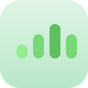

# MiAura (Beta)

A beautiful Frutiger Aero-inspired mood tracker for your browser. Track your daily mood with translucent, glowing signal bars and visualize your year at a glance.

## Features ✨

- 🎨 **Frutiger Aero Aesthetic** - Translucent gradients, glowing effects, and dreamy colors
- 📊 **5 Mood Levels** - From Fantastic to Down, with color-coded signal bars
- 📅 **Year Calendar View** - See your entire year of moods at a glance
- 🌍 **Bilingual Support** - English and French
- 💡 **Today Indicator** - Pulsing animation on today's date
- 💬 **Tooltips** - Hover over logged days to see date and mood
- 📈 **Year Navigation** - Browse past and future years
- 🎯 **Local Storage** - All your data stays private on your device

## Installation Instructions

### Step 1: Download

Download the `MiAura-Beta.zip` file and unzip it to a folder on your computer.

### Step 2: Enable Developer Mode

1. Open your browser (Chrome, Edge, Brave, or any Chromium-based browser)
2. Navigate to the extensions page:
   - **Chrome/Brave:** `chrome://extensions/`
   - **Edge:** `edge://extensions/`
3. Toggle **"Developer mode"** in the top right corner

### Step 3: Load the Extension

1. Click **"Load unpacked"** button
2. Navigate to the unzipped MiAura folder
3. Select the folder and click **"Select Folder"** or **"Open"**

### Step 4: Start Tracking!

Click the MiAura icon in your browser toolbar to open the popup and log your first mood! 🎉

## How to Use

### Tracking Your Mood

1. Click the MiAura icon in your toolbar
2. Hover over the mood orbs to see the signal bars animate
3. Click your mood for the day
4. The app automatically saves and navigates to your calendar

### Viewing Your Calendar

- Click the **📅** button to view your year
- Use **◀ ▶** arrows to browse different years
- Hover over logged days to see the date and mood
- Click **←** to return to mood selection

### Changing Language

- Click the **FR/EN** button to toggle between French and English

## Privacy & Data 🔒

- **100% Local** - All your mood data is stored locally in your browser
- **No Tracking** - We don't collect, transmit, or store any of your data
- **No Internet Required** - Works completely offline
- **Your Data** - Export your data anytime (feature coming in next version)

## Known Issues & Limitations

- This is a **BETA** version - expect some rough edges!
- Year rollover tested, but please report any date-related bugs
- No data export yet (coming in V1.1)
- Grid layout optimized for extension popup size

## Roadmap 🚀

**V1.1 (Next Release):**

- [ ] Export/import data
- [ ] Streak counter
- [ ] Weekly/monthly mood averages
- [ ] Edit past entries

**V2.0 (Future):**

- [ ] Notes field for each day
- [ ] Stand-up tracking features
- [ ] Dark mode
- [ ] Sound effects (optional)

## Feedback & Bug Reports

Found a bug? Have a suggestion? We'd love to hear from you!

**Please include:**

- Your browser and version
- Steps to reproduce the issue
- Screenshots if applicable

## Technical Details

- **Manifest Version:** 3
- **Permissions:** Storage only (for saving your mood data locally)
- **Browser Support:** Chrome, Edge, Brave, and other Chromium-based browsers
- **Storage:** LocalStorage (no size limits for this app)

## Credits

Designed with love and inspired by the optimistic aesthetics of Windows Vista and Frutiger Aero design.

---

**Version:** 1.0-beta  
**Last Updated:** October 2025  
**License:** MIT

---

**Enjoy tracking your moods! ✨**

_Remember: Your mental health matters. If you're struggling, please reach out to a mental health professional._
