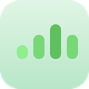

# MiAura

A Frutiger Aero-inspired mood tracker for your browser. Log your daily mood with glowing orbs and visualize your history as a smooth wave graph.

## Features

- **Frutiger Aero Aesthetic** — Translucent gradients, glowing orbs, particle effects, and dreamy colors
- **5 Mood Levels** — From Fantastic to Down, with a color-coded hero orb that reacts to your selection
- **Wave Graph Calendar** — Smooth SVG curve renders your mood history across week, month, or year views
- **Streak & Total Counter** — Track your logging streak or total days logged; toggle between modes in Settings
- **5 Languages** — English, French, Portuguese, German, Swedish
- **Today Indicator** — Pulsing animation on today's date in the calendar
- **Tooltips** — Hover logged days to see date and mood
- **Founding Member Badge** — Shown to users who joined in the first 100
- **Local Storage** — All data stays private on your device via `chrome.storage.local`

## Installation

### Step 1: Download

Download the latest `miaura-v*.zip` release and unzip it to a folder on your computer.

### Step 2: Enable Developer Mode

1. Open your browser (Chrome, Edge, Brave, or any Chromium-based browser)
2. Navigate to the extensions page:
   - **Chrome/Brave:** `chrome://extensions/`
   - **Edge:** `edge://extensions/`
3. Toggle **"Developer mode"** in the top right corner

### Step 3: Load the Extension

1. Click **"Load unpacked"**
2. Select the unzipped MiAura folder
3. Click **"Select Folder"** or **"Open"**

### Step 4: Start Tracking

Click the MiAura icon in your browser toolbar to log your first mood.

## How to Use

### Logging Your Mood

1. Click the MiAura icon in your toolbar
2. Hover over the mood orbs — the hero orb and background react to your selection
3. Click your mood for the day
4. The app saves and navigates to your calendar

### Viewing Your Calendar

- Tap the **calendar icon** in the bottom nav to open the wave graph
- Use the **W / M / Y** toggle to switch between week, month, and year views
- Use the **‹ ›** arrows to navigate back and forward
- In year view, click a month column to jump to that month
- Hover logged days for a date and mood tooltip

### Settings

Tap the **settings icon** in the bottom nav to:

- Switch the counter between **Streak** and **Total** mode
- Change language (English, Français, Português, Deutsch, Svenska)
- Leave a review
- Access test mode controls

## Privacy & Data

- **100% Local** — All mood data is stored in `chrome.storage.local` on your device
- **No Tracking** — No data is collected, transmitted, or stored externally
- **No Internet Required** — Works completely offline

## Technical Details

- **Manifest Version:** 3
- **Permissions:** `storage` only
- **Browser Support:** Chrome, Edge, Brave, and other Chromium-based browsers

## Feedback & Bug Reports

Found a bug or have a suggestion? Please include:

- Your browser and version
- Steps to reproduce
- Screenshots if applicable

---

**Version:** 1.4.0  
**License:** MIT
